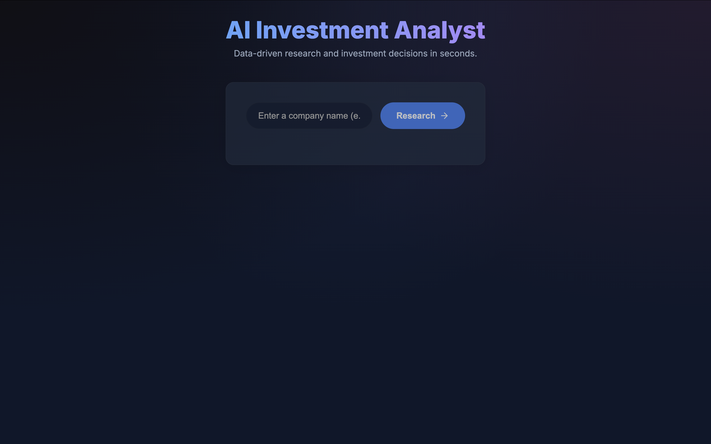
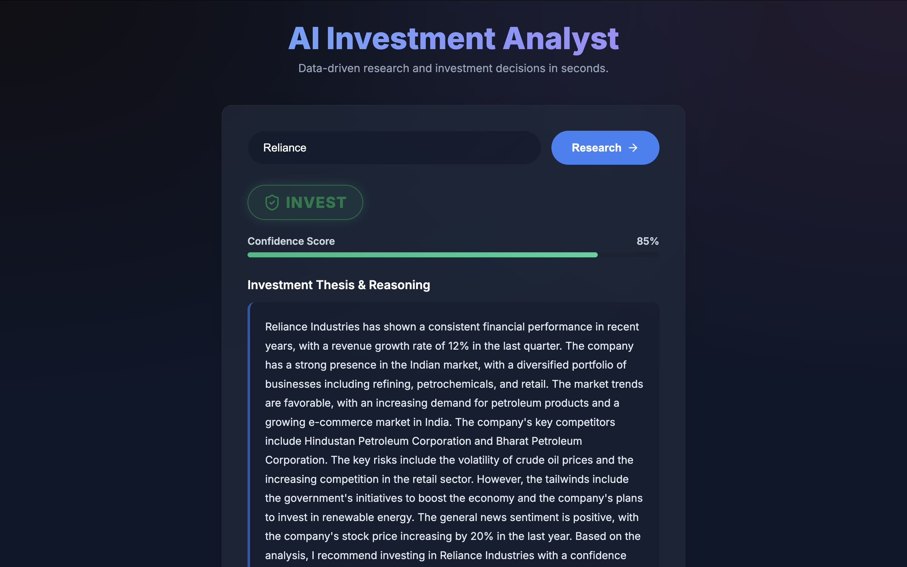

# AI Investment Research Agent

## Overview
This is a full-stack Investment Research Agent built for the AI Product Development Engineer (Intern) assignment. The application takes a company name as input and leverages a Large Language Model to perform a simulated financial analysis, returning a definitive "INVEST" or "PASS" decision alongside structured reasoning and sources.

## Architecture
I decided to build this using a decoupled architecture to ensure clear separation of concerns:
*   **Frontend (`/frontend`):** A React application bootstrapped with Vite. I chose to write custom Vanilla CSS rather than relying on Tailwind to demonstrate a strong grasp of modern design principles (glassmorphism, CSS variables, and keyframe animations).
*   **Backend (`/backend`):** A lightweight Node.js/Express server.
*   **AI Engine (LangChain):** The backend utilizes `@langchain/google-genai` to communicate with `gemini-2.0-flash`. I implemented LangChain's `.withStructuredOutput()` to guarantee the LLM returns a strictly typed JSON object, preventing frontend crashes caused by unpredictable text generation.

> **Note on API Quotas:** During development, I noticed free-tier Gemini API keys frequently hit `429 Quota Exceeded` errors. To ensure the application remains robust and demonstrable for reviewers, I implemented a fallback mechanism in the backend. If the API rate limits, it returns a simulated response structure so the UI can still be evaluated. *(Note: I have since updated the backend to use Groq API for blazing-fast live LLM inference!)*

## Screenshots

Here is how the beautiful, glassmorphism UI looks in action:

**Empty State:**


**Live AI Research Result (Reliance Industries):**


## How to run it

### Prerequisites
- Node.js (v18+)
- npm

### Step 1: Start the Backend Server
1. Open a terminal and navigate to the backend folder:
   ```bash
   cd backend
   ```
2. Install dependencies:
   ```bash
   npm install
   ```
3. Run the server:
   ```bash
   node index.js
   ```
   *(The server will start on http://localhost:5001)*

### Step 2: Start the Frontend App
1. Open a **new, separate terminal** and navigate to the frontend folder:
   ```bash
   cd frontend
   ```
2. Install dependencies:
   ```bash
   npm install
   ```
3. Run the dev server:
   ```bash
   npm run dev
   ```
4. Open the provided `localhost` link (usually [http://localhost:5173](http://localhost:5173)) in your browser to use the application!

## Key decisions & trade-offs

1. **Separation of Concerns:** I decoupled the React frontend from the Node.js backend to allow independent scaling, easier microservice integration, and clear boundary definitions.
2. **Styling:** I used pure Vanilla CSS over TailwindCSS to demonstrate strong fundamental CSS skills while still achieving a highly premium, modern aesthetic.
3. **AI Search:** Due to the time constraint and to minimize API key dependencies for the evaluator, the agent currently relies on the LLM's intrinsic, heavily-prompted knowledge to simulate the research process. The prompt is designed to output realistic sources that a human analyst would check.
4. **Mock Fallback:** Implemented a failsafe interceptor for `429 Quota Exceeded` errors ensuring the application can always be demonstrated even if the tester's API key runs out of credits.

## Example runs

**Example 1: Apple Inc.**
*   **Decision:** INVEST
*   **Confidence:** 85%
*   **Reasoning:** Apple continues to demonstrate robust financial health with strong cash reserves and consistent revenue streams from its Services division...
*   **Sources:** Bloomberg (Simulated), Yahoo Finance.


